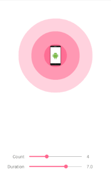

Pulsator4Droid
===========

### Forked from [booncol/Pulsator4Droid](https://github.com/booncol/Pulsator4Droid)

Pulse animation for Android.



## How to build

```bash
./gradlew :pulsator4droid:assemble
```
Generated aar file will be in `pulsator4droid/build/outputs/aar/` folder, copy it to your project's app/libs folder.
Then add:
```aidl
implementation fileTree(include: ['*.aar'], dir: 'libs')
```
To your dependencies

## Usage
### In layout

```xml
<pl.bclogic.pulsator4droid.library.PulsatorLayout
	android:id="@+id/pulsator"
	android:layout_width="match_parent"
	android:layout_height="match_parent"
	app:pulse_count="4"
	app:pulse_duration="7000"
	app:pulse_repeat="0"
	app:pulse_color="@color/colorAccent"
	app:pulse_startFromScratch="false"
	app:pulse_interpolator="Linear">
</pl.bclogic.pulsator4droid.library.PulsatorLayout>
```

Use following properties

- `pulse_count` : Number of pulse circles
- `pulse_duration` : Duration in milliseconds of single pulse
- `pulse_repeat` : Number of pulse repeats. Zero means `INFINITE`
- `pulse_color` : ARGB pulse color
- `pulse_startFromScratch` : Set to true if animation should start from the beginning
- `pulse_interpolator`: Set interpolator type used for animation. Accepted values are *"Linear"*, *"Accelerate"*, *"Decelerate"*, *"AccelerateDecelerate"*
- `pulse_minScale`: Initial scale of the pulse
- `pulse_maxScale`: Final scale of the pulse

### In activity

```java
PulsatorLayout pulsator = (PulsatorLayout) findViewById(R.id.pulsator);
pulsator.start();
```

## Demo

Try the demo app and change the count and duration parameters in real time.

## Author

**Lukasz Majda** (lukasz.majda@gmail.com)

Inspired by [iOS Pulsator library](https://github.com/shu223/Pulsator) by **Shuichi Tsutsumi**


## License

```
The MIT License (MIT)

Copyright (c) 2016 Lukasz Majda

Permission is hereby granted, free of charge, to any person obtaining a copy
of this software and associated documentation files (the "Software"), to deal
in the Software without restriction, including without limitation the rights
to use, copy, modify, merge, publish, distribute, sublicense, and/or sell
copies of the Software, and to permit persons to whom the Software is
furnished to do so, subject to the following conditions:

The above copyright notice and this permission notice shall be included in all
copies or substantial portions of the Software.

THE SOFTWARE IS PROVIDED "AS IS", WITHOUT WARRANTY OF ANY KIND, EXPRESS OR
IMPLIED, INCLUDING BUT NOT LIMITED TO THE WARRANTIES OF MERCHANTABILITY,
FITNESS FOR A PARTICULAR PURPOSE AND NONINFRINGEMENT. IN NO EVENT SHALL THE
AUTHORS OR COPYRIGHT HOLDERS BE LIABLE FOR ANY CLAIM, DAMAGES OR OTHER
LIABILITY, WHETHER IN AN ACTION OF CONTRACT, TORT OR OTHERWISE, ARISING FROM,
OUT OF OR IN CONNECTION WITH THE SOFTWARE OR THE USE OR OTHER DEALINGS IN THE
SOFTWARE.
```
